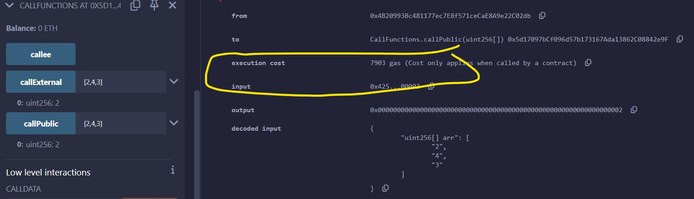
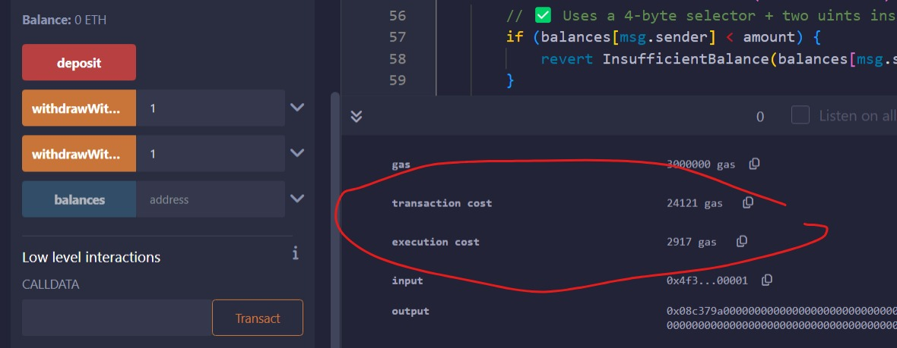
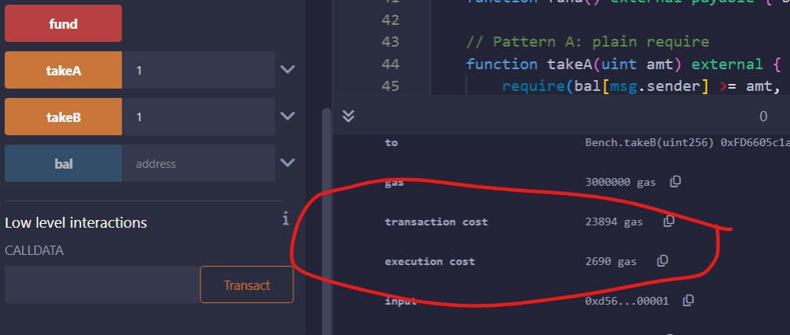

# Developer

**Name**: Qasim Ikram  
**Task Date**: 5/14/2025

---

## Gas of Calling `public` Functions from Another Contract



---

## Gas of Calling `external` Functions from Another Contract


When **calling a function from another contract**, use `external` instead of `public`.

| Visibility | Description                            | Gas Usage |
| ---------- | -------------------------------------- | --------- |
| `public`   | Creates a copy of arguments in memory  | Higher    |
| `external` | Reads arguments directly from calldata | Lower     |

### 🧪 Example Comparison:

<details>
<summary>Click to expand Solidity code example</summary>

```solidity
// SPDX-License-Identifier: MIT
pragma solidity ^0.8.7;

contract GasOptimization {

    function PublicFunction(uint[] memory data) public pure returns (uint) {
        return data.length > 0 ? data[0] : 0;
    }

    function ExternalFunction(uint[] calldata data) external pure returns (uint) {
        return data.length > 0 ? data[0] : 0;
    }

}

contract CallFunctions {
    GasOptimization public callee;

    constructor(GasOptimization _callee) {
        callee = _callee;
    }

    function callPublic(uint[] calldata arr) external view returns (uint) {
        return callee.PublicFunction(arr);
    }

    function callExternal(uint[] calldata arr) external view returns (uint) {
        return callee.ExternalFunction(arr);
    }
}

```

</details>

## Gas of Using `require` for validation checking



## Gas of Using `if/Revert Custom Error` for validation checking



When **Validating a function**, use `if/revert` instead of `require`.

| Visibility  | Description                                               | Gas Usage |
| ----------- | --------------------------------------------------------- | --------- |
| `require`   | If revert it's expensive                                  | Higher    |
| `If/Revert` | If it not revert it's expensive but inexpensive if revert | Lower     |

<details>
<summary>Code of Require/If Revert</summary>
````solidity

error BalTooLow();

contract Bench {
mapping(address => uint) public bal;

    function fund() external payable { bal[msg.sender] += msg.value; }

    // Pattern A: plain require
    function takeA(uint amt) external {
        require(bal[msg.sender] >= amt, "Low");  // short string
        bal[msg.sender] -= amt;
    }

    // Pattern B: custom error
    function takeB(uint amt) external {
        if (bal[msg.sender] < amt) {
            revert BalTooLow();
        }
        bal[msg.sender] -= amt;
    }

}

```
</details>
```
