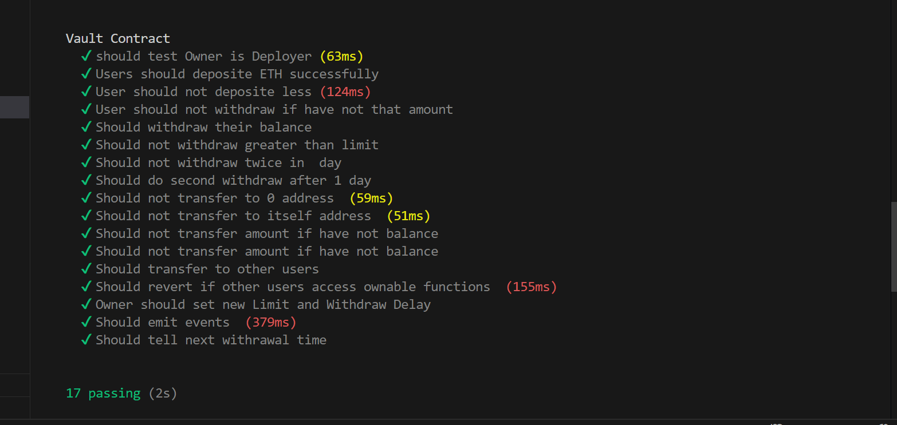
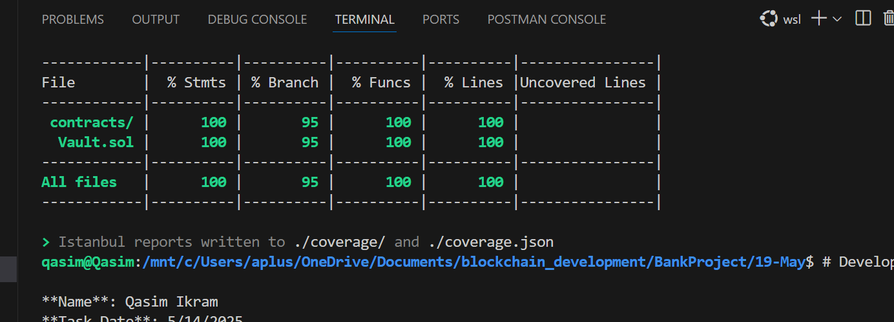

## Developer

- **Name:** Qasim Ikram
- **Task Date:** 5/19/2025

## Total test of Vault Smart Contract

## Total Coverage of Vault Smart Contract

--

## 🔐 Vault Smart Contract

This contract simulates a secure vault that allows users to deposit, withdraw, and transfer Ether with proper restrictions.

### Key Functions:

- `deposit()` – Allows users to deposit Ether into the vault.
- `withdraw(uint amount)` – Lets users withdraw funds with daily limit constraints.
- `transfer(address to, uint amount)` – Sends Ether to another address.

### 🛡️ Security Patterns Implemented

| Pattern                   | Description                                                                     |
| ------------------------- | ------------------------------------------------------------------------------- |
| **CEI**                   | _Checks-Effects-Interactions_ pattern to avoid reentrancy attacks.              |
| **Reentrancy Protection** | Reentrancy-safe by using CEI and minimal external interaction.                  |
| **Pull Over Push**        | Users withdraw their funds themselves, instead of receiving them automatically. |

---
